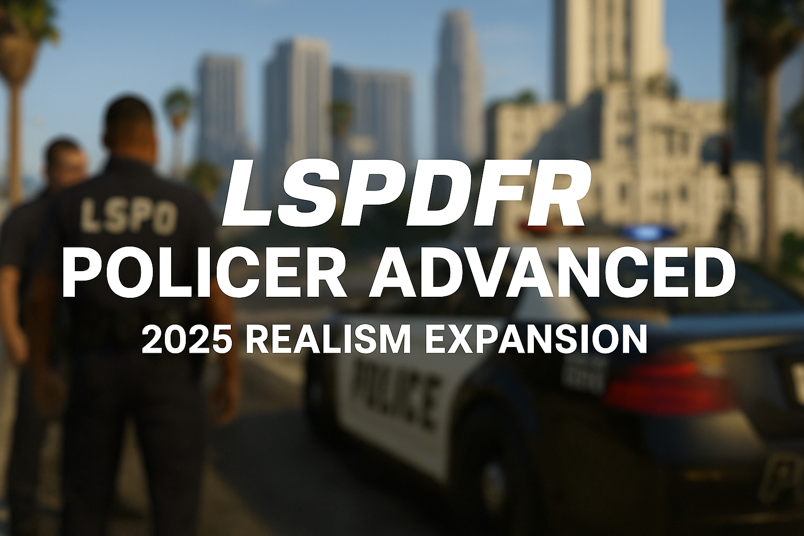

  

# 🚓 LSPDFR Policer Advanced

A modern plugin for LSPDFR that expands traffic stop realism and interaction, built from scratch for stability, modularity, and support for modern GTA V versions.

---

## ✅ Features (v1.0.0)

### 🚦 Traffic Stop System
- Smart detection when a suspect vehicle fully stops
- Clean notification prompts to approach and press **E**
- Modular interaction menu with options for ID, citation, warning, arrest, and more

### 📋 Full Citation System
- Two fully supported citation UIs:
  - **Traffic Citation Form** (with vehicle info)
  - **Ped Citation Form** (on-foot citations only)
- Supports multiple offenses, auto fine calculation, court summons checkbox, and offense notes
- Stores:
  - Suspect full name, gender, DOB
  - Fine amount and offense summary
  - Optional court data (verdict class, address, due date)
- Citations saved to:  
  `Plugins/LSPDFR/PolicerAdvanced/data/citations.xml`

### ⚖️ Court System
- Summonsed citations generate real court cases
- Court menu with two tabs:
  - **Pending Court Results**
  - **Resolved Cases**
- Realistic verdict logic:
  - U.S. or UK style sentencing
  - Randomized outcomes based on offense class
- Verdicts stored in:  
  `Plugins/LSPDFR/PolicerAdvanced/data/court_cases.xml`
- Supports:
  - TXD-based mugshots
  - Case numbers
  - Address and age
  - Cop logo and department banner

### 🧑‍✈️ On-Foot Ped Interaction System
- G-key menu when near stopped pedestrians
- Includes:
  - ID check
  - Verbal warning
  - Citation (on-foot)
  - Follow / Stop Following toggle
  - Grab / Dismiss
- Persona override ensures consistency with vehicle stops

### 🧾 Citation Persistence (XML)
- Citations written to XML with:
  - Name, fine, court fields, offense list
  - Vehicle details (if applicable)

### 🧠 Persona + Flag Detection
- Automatically applies:
  - Suspended license
  - Expired insurance/registration
  - Stolen vehicles
  - Wanted suspects
- Shared system ensures consistent behavior across:
  - MDT
  - Police Radio
  - ANPR
  - Alerts

### 📻 Police Radio System (Motorola-style UI)
- Custom image overlays for radio buttons and display
- Includes:
  - Plate check
  - Ped check
  - Code 3 backup
  - Additional slots coming soon
- Sound and visual feedback included

### 📱 Police Computer (MDT)
- Full Gwen-based tabbed interface
- Accessed from traffic stop or on-foot
- Includes:
  - **Person Lookup** (mugshot, license, warrant, court data)
  - **Vehicle Lookup** (plate, insurance, registration, VIN)
  - **Citation Records** (read-only history)
- Integrated with:
  - ANPR persona
  - Court verdicts
  - Citation database
  - Mugshot TXDs and PNG fallback

### 🔊 Radio Audio SFX
- Triggered by plate hits and radio events
- Category-based folder structure for dispatch clips
- Custom override support

### 🔍 ANPR (Automatic Number Plate Recognition)
- Scans front-facing vehicles in real time
- Detects:
  - Owner wanted
  - Invalid/suspended license
  - Stolen vehicle
  - Expired/no insurance or registration
- Triggers alerts, radio playback, UI notifications

### ⚠️ Warning System
- Issue verbal warnings
- Tracks warnings in:  
  `Plugins/LSPDFR/PolicerAdvanced/data/warnings.xml`

### 💉 Contraband Injection
- Injects items into ped inventory based on symptoms
- Works on both on-foot and traffic stops
- Tied into ID check and frisk systems

### 🧠 Symptom Detection
- Detects signs like:
  - Slurred speech
  - Jittery or nervous behavior
  - Red eyes
  - Alcohol/drug odor
- Powers:
  - Contraband system
  - Dialog questioning
  - Drug & alcohol tests

### 🧪 Drug & Alcohol Tests
- Enables when symptoms are present
- Tied into:
  - Symptom detection
  - Questioning menus
  - Behavior flags

### ❓ Dialog Question System
- Ask suspects questions
- Symptom-aware responses
- Designed for immersive roleplay

### 🧬 Internal Logging
- Debug and user-friendly logs written per feature
- Tracks issued citations, court outcomes, ANPR hits, and more

### 📸 Ped Mugshot Headshots
- Automatically captures TXD-based mugshots
- PNG snapshots saved for court records and MDT display
- Drawn directly via TXD in Gwen UI

### 🚓 Ambient Events System
- Currently includes:
  - **Drunk Driver** (erratic swerving)
  - **Known Gang Vehicle**
  - **Bad State Vehicle** (rusty/unroadworthy)
- Events spawn randomly, with cooldowns and pursuit/stop logic

### 🚗 Vehicle Manager Menu
- RAGENativeUI-based menu for inspecting vehicles
- Works for suspect or police vehicles
- Includes:
  - **Search Vehicle**
  - **Open Trunk**
  - **Tint Reader**
  - **Tyre Tread Check**
  - **Repair Vehicle** (police only)
  - **Restock Equipment** (police only)
- Future integration planned with Evidence System
- Open with **F7** (configurable)

### 📝 Arrest Report System
- Dedicated **Arrest Report Form** in MDT
- Includes:
  - Suspect name, DOB, gender, address
  - Arrest reason, charges, officer details
  - Auto-filled location and time
  - Fine amount and court flag
- Arrests always result in a court case
- Court case is created automatically with:
  - Charges
  - Address and age
  - Mugshot TXD
  - Realistic verdict due date
- Reports saved to:  
  `Plugins/LSPDFR/PolicerAdvanced/data/arrestreports.xml`

### 🧠 Built on CommonLibSparky81x
- Handles:
  - INI reading and key input
  - Popup display
  - Logging and debug overlays
  - Ped and vehicle helper utilities
  - Zone detection

---

## 🛠 Installation

1. Drag and Drop contents of GTA5 Folder to your root folder for GTA5.

4. Optional Assets:
   - Court banner TXD →  
     `mods\update\update.rpf\x64\textures\script_txds.rpf\3dtextures.ytd`

---

## 🔧 Requirements

| Component              | Version     |
|------------------------|-------------|
| GTA V                  | 1.0.3504.0+ |
| LSPDFR                 | 0.4.9       |
| RAGEPluginHook         | 1.102+      |
| CommonLibSparky81x     | 1.0.0.0     |

---

## 📊 Development Phases (Completed)

| Phase | Feature                       | Status     | Notes                                                              |
|-------|-------------------------------|------------|--------------------------------------------------------------------|
| 1     | Traffic Stop Interaction      | ✅ Complete | Stop key + interaction menu                                        |
| 2     | Citation System               | ✅ Complete | Issue citations via UI                                             |
| 2.5   | Citation Persistence (XML)    | ✅ Complete | Citations saved to XML                                             |
| 3     | Driver/Vehicle Flag Detection | ✅ Complete | Persona, license, stolen, and more                                 |
| 4     | Police Radio System           | ✅ Complete | Plate/ped checks and alerts                                        |
| 5     | Police Computer (MDT)         | ✅ Complete | Lookup system, tabs, mugshots                                      |
| 6     | ANPR System                   | ✅ Complete | Live scanning and alerts                                           |
| 7     | Warning System                | ✅ Complete | Verbal warnings with tracking                                      |
| 8     | Drug & Alcohol Tests          | ✅ Complete | Integrated with symptom logic                                      |
| 9     | Internal Logging              | ✅ Complete | Debug and persistent logging                                       |
| 10    | Symptom Detection             | ✅ Complete | Nervous, slurred, red eyes, etc.                                   |
| 11    | Dialog Questions              | ✅ Complete | Question-based symptom detection                                   |
| 12    | Court System                  | ✅ Complete | Verdicts, mugshots, XML storage                                    |
| 13    | Citation UI System            | ✅ Complete | Vehicle and ped form layouts                                       |
| 14    | On-Foot Ped Interaction       | ✅ Complete | G menu: follow, dismiss, citation                                  |
| 15    | Persona Overrides             | ✅ Complete | Unified persona per interaction                                    |
| 16    | Contraband Injection          | ✅ Complete | Symptom-based contraband items                                     |
| 17    | Ambient Event System          | ✅ Complete | Drunk Driver, Gang Car, Bad Vehicle                                |
| 18    | Ped Mugshot Headshot System   | ✅ Complete | TXD headshot saved + rendered in UI                                |
| 19    | Vehicle Manager               | ✅ Complete | Search, test, trunk toggle, repair, restock                        |
| 20    | Arrest System Core            | ✅ Complete | Arrest recording, fine + charges, XML                              |
| 21    | Arrest Reports UI             | ✅ Complete | Gwen form, charge selection, auto court case                       |

---

## 🧭 Planned & Upcoming Features

| Feature               | Status         | Notes                                                                |
|-----------------------|----------------|----------------------------------------------------------------------|
| Evidence System       | 📋 Planned     | Track and store collected evidence items                            |
| Vehicle Seizure       | 📋 Planned     | Tow/impound logic, vehicle flagging                                 |
| XP & Rank Progression | 📋 Planned     | Officer leveling and unlock system                                  |
| Radio SFX System      | 📋 Planned     | Dispatch .wav playback via categories (some triggers exist)         |

---

## 👤 Author

**Sparky**  
GitHub: [github.com/Sparky81x](https://github.com/Sparky81x)

---

## ⚠ Disclaimer

This mod is a community project and is not affiliated with Rockstar Games, Take-Two, or LCPDFR.  
Use at your own risk. Built for realism, performance, and flexibility.
